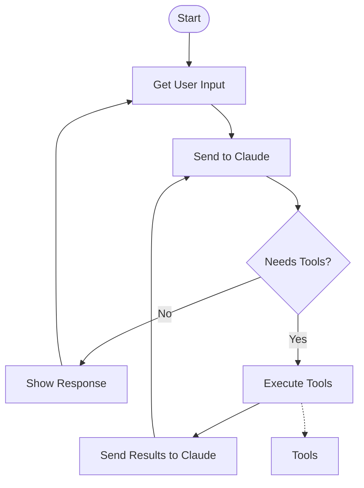

# Coding Agent

A simple coding agent built with Claude that can view/edit files, search the web, and execute bash commands—all in ~200 lines.



## Quick start

1. **Create virtual environment and install dependencies**:
   ```bash
   # Option 1: uv (recommended)
   uv venv
   source .venv/bin/activate # On Windows: .venv\Scripts\activate
   uv sync

   # Option 2: Poetry
   python -m venv .venv
   source .venv/bin/activate # On Windows: .venv\Scripts\activate
   poetry install

   # Option 3: Standard venv + pip
   python -m venv .venv
   source .venv/bin/activate  # On Windows: .venv\Scripts\activate
   pip install -e .
   ```

2. **Setup environment**:
   ```bash
   echo "ANTHROPIC_API_KEY=your_key_here" > .env
   ```

3. **Run the CLI agent**:
   ```bash
   uv run simple_agent.py
   ```

4. **Or run the interactive notebook**:
   ```bash
   uv run marimo run notebook.py
   ```

## What it does

- **Fix broken files**: `"fix broken_file.py"`
- **Research and implement**: `"research new Python 3.13 features and write an example"`
- **Create new code**: `"write a tip splitting calculator"`

## Architecture

The agent uses a simple loop:
1. Get user input
2. Send to Claude with tools (file editor, web search, bash)
3. Execute any requested tools
4. Return results and repeat

## Files

- `simple_agent.py` - CLI version
- `notebook.py` - Interactive Marimo notebook with documentation
- `public/instructions.md` - System prompt and instructions

## Requirements

- Python 3.13+
- Anthropic API key