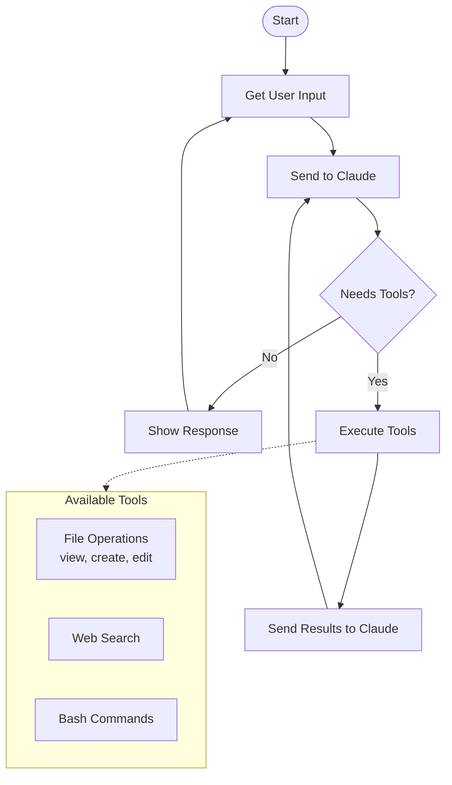

# Simple Agent Flow

## Core Structure

The agent is just **two nested loops**:

1. **Outer Loop**: Get user input → Send to Claude → Show response
2. **Inner Loop**: If Claude needs tools → Execute them → Send results back

## Tools

- **File Operations**: Read, create, and edit files
- **Web Search**: Search the internet for information  
- **Bash Commands**: Run shell commands for testing, installation, etc.

That's it! A coding agent in ~200 lines.